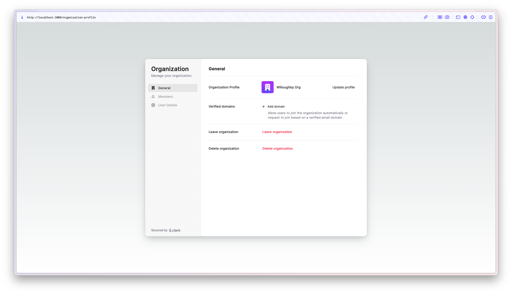

# Clerk Take Home

Justin Willoughby applying for Senior Solutions Engineer

## Instructions

Create a simple application using Clerk and your favorite language, along with a doc outlining details about your design and implementation (below). It's important to note that this exercise should take a few hours at most — we only want to assess your ability to design a solution, write some code, and explain it.

Your output should be a program that creates an onboarding experience with the various authentication flows outlined in the attached image. After successfully going through each flow, the User should be able to access a simple landing page for the Organization's workspace. You can find the necessary information on Users, Organizations, APIs and Components for this exercise in our documentation: https://clerk.com/docs

We encourage you to use the stack you're most comfortable with, but find that the best project submissions use simple frameworks (e.g. Next.js, React, Express etc.). We're also not grading your front-end skills, so no need to spend a lot of time perfecting your CSS.

We'll also extend this example later in the process if you interview with us, asking you to present to one of our team members and add a feature. We suggest your application is structured in such a way that you’re able to run it locally and integrate other Clerk features easily later.

When you're done, push the project to Github or place in a zip file and return along with a doc (README.md, a Google doc, etc.) containing the following:
- An overview of your application in 1 page or less: how does it work? What does it do? Which Clerk features / APIs does it use?
- A paragraph or two about how you approached this problem.
- A paragraph about why you picked the language/framework you did.
- A paragraph or two on how you might extend this if you were building a more robust instance of the same application.

This document will give us a chance to assess your writing abilities as well.

## Overview

I created a Next.js application (Next.js 14, App Router, TypeScript, Tailwind) and implemented the provided onboarding flow using Clerk's Account Portal, pre-built components, middleware and a variety of other capabilities in the sdk. Screenshots included [here](#screenshots).

The app opens to a public page with sign-in and sign-up buttons as well as a list of links that are helpful testing the various pages. The top-level layout sets up the ClerkProvider, and the landing page utilizes the ClerkLoading, ClerkLoaded, SignIn, SignedOut, SignInButton, SignUpButton, and UserButton components.

The sign-up button redirects you to the Clerk Account Portal to sign up with email/password or Google. If you choose to sign up with email you validate your email in the Account Portal as well before returning to the app.

After sign-up, you're redirected back to the app to the `/onboarding` page where you enter your date of birth and city/state. That page is a client component with a form that calls a server action on submit to save the data to the user's publicMetadata using the Clerk client. I also write a boolean onboardingComplete to the publicMetadata to capture if the user finished onboarding. I added the publicMetadata to the session token in the dashboard so I would have easy access to it later. The middleware and the `/onboarding` page both use that boolean to conditionally redirect the user where they need to be. If a user is logged in but has not completed onboarding, then the middleware redirects them to `/onboarding`. If the user goes to `/onboarding` but they have already completed it, they are redirected to the next step.

After onboarding is complete, the user is directed to the `/organization` page which uses the Clerk OrganizationList component to give the user the ability to select an existing organization (if they have been invited, or they have a verified domain), or create a new one. If a user creates a new organization, they are prompted to invite users. I hid the personalProfile as an option so they must select an organization.

After they decide on their organization, the user is directed to the `/organization-profile` page which uses the Clerk OrganizationProfile component. This is the final landing page where they can manage the organization, view memberships/invitations, and I created a custom page for the OrganizationProfile component that displays the date of birth and city/state that was captured during onboarding. I also included a link back to the `/` public page to make testing easier.

## Approach

The flow broke down into a few component parts.

1. Sign the user in or up
2. Collect additional data to complete the sign up
3. Have the user select or create an organization
4. Display organization and profile data on a landing page

From working with Clerk on my side projects, and from reviewing the documentation, I knew that Clerk offered three ways to integrate.

1. Account Portal
2. Pre-Built Components
3. Custom Flow With API

The Account Portal is the fastest way to get user management setup for your application because the pages are Clerk hosted. The further down the stack you go, the more control you gain, but you must own more of the code. Custom Flows are incredibly powerful and give you complete control over your user's journey, but where possible, I wanted to use the Account Portal, and pre-built components. That's the Clerk magic.

Breaking the flow down into its component parts and then reviewing the documentation helped me decide what Clerk features I needed to use.

1. Sign the user in or up  
    - Email/Password/Verification + Google = OOTB Account Portal
2. Collect additional data to complete the sign up  
    - Customer specific logic. No built-in component. Build custom.
3. Have the user select or create an organization.
    - Select or Create Org + Invite. Matched OrganizationList perfectly.
4. Display organization and profile data on a landing page
    - Manage org workspace + see profile data. Matched OrganizationProfile perfectly.

I didn't come to all these conclusions right at the start. I setup a local app and played with different parts of the Account Portal and the pre-built components until it clicked.

## Why Next.js?

I've been using Next.js for all my recent side projects and I've been loving it. I appreciate that it's opinionated in how you structure your projects, but you're still free to break down your components how you like. And the ability to navigate from client to server within the same project is so powerful. I also know that many of Clerk customers are Next.js users so I wanted to show that I'm capable with the framework.

## How Would I Extend This?

If I were building a more robust version of the same application, there are several things I would like to do.

I really admire well thought out, beautiful UI/UX. Clerk does this so well, but the pages I crafted on my own could use more work. My overall user journey has some inconsistency in the UI/UX and a savvy user will see it in the domain name as well since I weaved together the Account Portal pages and the pre-built components. I would spend more time getting my domain registered so the Account Portal redirect stays in the same domain as my app, and I would tailor my custom pages and drop-in components a little more, so everything has a consistent look and feel.

There are also a few Clerk features that I think would be great adds. Adding a second or third social provider (maybe Apple and Facebook) would help give users more options and potentially improve conversion. Adding MFA and/or passkeys would help boost the security of the application. MFA might get more adoption now, but I'm a big fan of passkeys so I would add them as an option. The more we move away from passwords, towards phishing resistant forms of authentication, the better. Account protection is on by default so you get brute force protections, but turning on bot protection in production to better protect sign ups would help keep your directory cleaner.

## Run Locally

1. `git clone` the repo
2. `cd` into the repo
3. `npm install`
4. Setup a new Clerk App in the Clerk Dashboard with email and Google authentication options
5. Create `.env.local` with your Clerk keys
6. Add `public_metadata` to the session token as `metadata` in the Clerk Dashboard

7. Enable organizations for your app in the Clerk Dashboard

8. `npm run dev`

## Screenshots

